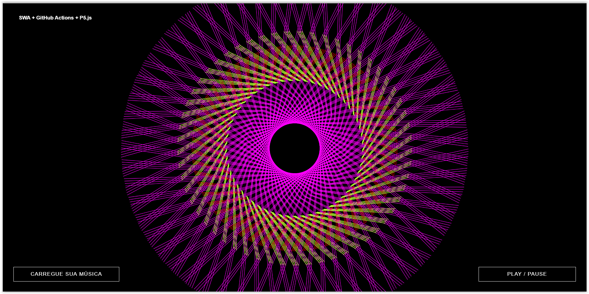

# 🎵 Player de Música com P5.js + SWA + GitHub Actions

<p align="center">
  
</p>

Music Player em JavaScript usando a biblioteca **[p5.js](https://p5js.org/examples/)**. O projeto foi baseado no seguinte artigo **[AQUI](https://tympanus.net/codrops/2018/03/06/creative-audio-visualizers/)**

A intenção dessa demo é não ensinar sobre o p5.js, mas sim, mostrar a todos como é fácil realizar deploy de aplicações estáticas usando o serviço Azure Static Web Apps e como podemos integrar facilmente com o GitHub Actions!

Caso desejam saber um pouco mais sobre a biblioteca p5.js, estarei disponibilizando links e recursos necessários sobre a bíblioteca aqui no README.md

## 🚀 Recursos Utilizados 

- **[Visal Studio Code](https://code.visualstudio.com/?WT.mc_id=musicplayer_swa-github-gllemos)**
- **[JavaScript library - P5.js](https://p5js.org/examples/)**
- **[Azure Static Web Apps](https://docs.microsoft.com/azure/static-web-apps/?WT.mc_id=staticwebapps-devto-gllemos&WT.mc_id=musicplayer_swa-github-gllemos)**
- **[GitHub Actions](https://docs.github.com/en/actions)**

## ⭐️ Conta - Azure For Students 

Caso você seja um(a) estudante de alguma Instituição de Ensino de Faculdade ou Universidade, poderá criar sua conta no **[Azure for Students](https://azure.microsoft.com/free/students/?WT.mc_id=musicplayer_swa-github-gllemos)**. Essa conta te dará o benefício em possuir crédito de USD 100,00 para usar os serviços de maneira gratuita, sem necessidade de possuir um cartão de crédito. Para ativar essa conta, bastam acessar o link ao lado: **[AQUI](https://azure.microsoft.com/free/students/?WT.mc_id=musicplayer_swa-github-gllemos)**

## 🔥 Executando aplicação Localmente

Antes de iniciar os passos abaixo é muito importante que você execute nesse momento o MongoDb localmente!

1) Instalar os pacotes com o comando: (dentro da pasta `src`)

``` 
> npm install
```

2) Depois executar o seguinte comando para executar a aplicação (dentro da pasta `src`):

```
> nodemon
```

Depois bastam abrir o postamn em **localhost:8000** e testar as requisições

E vòilá! :heart: :heart:

## ❗️ Recursos e Links Importantes

- ✅ **[Documentação Oficial do Azure Static Web Apps](https://docs.microsoft.com/azure/static-web-apps/?WT.mc_id=musicplayer_swa-github-gllemos)**
- ✅ **[Curso Microsoft Learn - Publicando uma aplicação e API JavaScript do Angular, React, Svelte ou Vue com Azure Static Web Apps](https://docs.microsoft.com/learn/modules/publish-app-service-static-web-app-api/?WT.mc_id=musicplayer_swa-github-gllemos)**
- ✅ **[Curso Microsoft Learn - Criando e publicando uma aplicação Web estático com o Gatsby e Azure Static Web Apps](https://docs.microsoft.com/learn/modules/create-deploy-static-webapp-gatsby-app-service/?WT.mc_id=musicplayer_swa-github-gllemos)**
- ✅ **[Curso Microsoft Learn - Compilando fluxos de trabalho de integração contínua (CI) com o GitHub Actions](https://docs.microsoft.com/learn/modules/github-actions-ci/?WT.mc_id=musicplayer_swa-github-gllemos)**
- ✅ **[Documentação Oficial do P5.sound](https://p5js.org/reference/#/libraries/p5.sound)**
- ✅ **[Artigo baseado na demo](https://tympanus.net/codrops/2018/03/06/creative-audio-visualizers/)**

## ❓ Tenho Dúvidas... O que Faço?! 

Caso tenham dúvidas aos códigos desenvolvidos durante a série de artigos, sintam-se a vontade em abrir uma **[ISSUE AQUI](https://github.com/glaucia86/music-player-swa/issues)**. Assim que possível, estarei respondendo as todas as dúvidas que tiverem!
